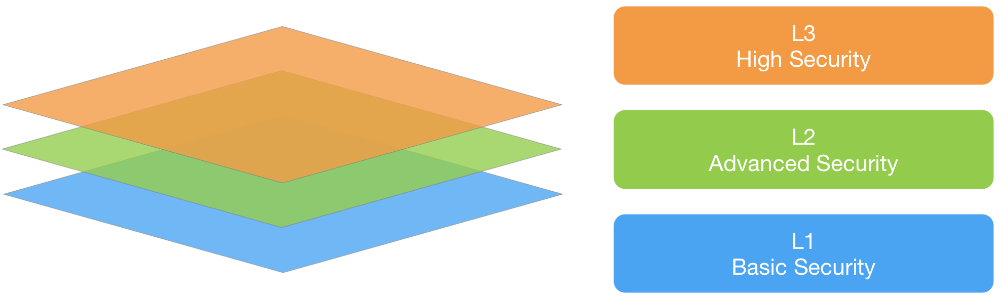

# Verwendung des CSVS

Der CSVS hat zwei Hauptziele:

* Unterstützung von Organisationen bei der Entwicklung und Wartung sicherer Container und Containerinfrastrukturen.
* Schaffen eines einheitliches Verständnisses zwischen Sicherheitsdienstleistern, Anbietern von Sicherheitstools und Anwendern.

## Sicherheitsüberprüfungsstufen für Container

Der CSVS definiert drei Sicherheitsüberprüfungsstufen, wobei mit jeder Stufe die Sicherheitsanforderungen erhöht werden.

* CSVS Level 1 ist grundsätzlich für alle Containerprojekte gedacht.
* CSVS Level 2 ist für Containerprojekte gedacht, die mit vertraulichen Daten oder Geschäftslogik in Kontakt kommen und entsprechend zusätzlichen Schutz erfordern.
* CSVS Level 3 ist für die kritischsten Containerprojekte gedacht, die hoch sensitive Transaktionen durchführen, vertrauliche persönliche oder medizinische Daten enthalten, oder für alle Container, die grundsätzlich ein Höchstmaß an Vertrauen erfordern.

Jede Stufe enthält eine Liste von Sicherheitsanforderungen. Jede dieser Anforderungen kann auch sicherheitsspezifischen Features und Funktionen zugeordnet werden, die in die Container oder die zugrunde liegende Infrastruktur integriert werden müssen.

Bild 1 - Container Security Verification Standard Sicherheitsüberprüfungsstufen

## Verwendung des Standards

Eine der besten Möglichkeiten, den Container Security Verification Standard zu verwenden, besteht darin, ihn als Vorlage zu verwenden, um eine Sicherheitscheckliste zu erstellen, die für Ihr Projekt, Ihre Plattform oder Ihre Organisation spezifisch angepasst wird. Das Anpassen des CSVS an Ihre Anwendungsfälle erhöht den Fokus auf die Sicherheitsanforderungen, die für Ihre Projekte und Umgebungen am relevantesten sind.

### Level 1: Opportunistisch

Eine container-basierte Infrastruktur / Lösung erreicht CSVS Level 1 (oder Opportunistic), wenn sie bekannte Sicherheitsbedrohungen, die leicht zu entdecken und leicht zu missbrauchen sind, angemessen abwehrt.

Stufe 1 eignet sich in der Regel für Anwendungen, bei denen ein geringes Vertrauen in die korrekte Verwendung von Sicherheitskontrollen einschließlich der Verfügbarkeit erforderlich ist, oder um eine schnelle Analyse einer Flotte von Unternehmensanwendungen durchzuführen oder die Erstellung einer priorisierten Liste von Sicherheitsanforderungen als Teil eines Multi-Phasen Vorgehens zu unterstützen. Wir betrachten Level 1 als das für alle Containerprojekte erforderliche Minimum. Wenn die von Ihrer containergestützten Lösung verarbeiteten Daten einen hohen Wert haben, möchten Sie selten eine Überprüfung bei Stufe 1 beenden.

### Level 2: Standard

Eine containergestützte Infrastruktur / Lösung erreicht CSVS Level 2 (oder Standard), wenn sie die meisten Risiken, die heute mit containergestützten Lösungen verbunden sind, angemessen abwehrt.

Stufe 2 stellt sicher, dass Sicherheitskontrollen vorhanden sind, effektiv / getestet sind und in der gesamten Lösung verwendet werden. Stufe 2 ist in der Regel für containergestützte Projekte geeignet, die wichtige und vertrauliche Transaktionen abwickeln, einschließlich solcher, die vertrauliche Informationen verarbeiten, geschäftskritische oder vertrauliche Funktionen implementieren oder andere vertrauliche Assets verarbeiten.

### Level 3: Fortgeschritten

CSVS Level 3 ist die höchste Überprüfungsstufe innerhalb des CSVS. Diese Ebene ist in der Regel für containergestützte Lösungen reserviert, für die ein hohes Maß an Sicherheitsüberprüfung erforderlich ist, z. B. in Bereichen wie Militär, Gesundheit und Sicherheit, kritische Infrastruktur usw.

Unternehmen benötigen möglicherweise CSVS Level 3 für Anwendungen, die wichtige Funktionen ausführen, bei denen ein Ausfall die Betriebsabläufe des Unternehmens und sogar dessen Überlebensfähigkeit erheblich beeinträchtigen kann. Eine container-basierte Lösung erreicht CSVS Level 3 (oder Advanced), wenn sie sich angemessen gegen fortgeschrittene Gegner verteidigt und außerdem Prinzipien eines guten Sicherheitsdesigns demonstriert.

Eine Anwendung auf CSVS Level 3 erfordert eine gründlichere Analyse, Architektur, Codierung und Prüfung als alle anderen Ebenen. Eine sichere Containerinfrastruktur ist auf sinnvolle Weise modularisiert (um z. B. Ausfallsicherheit, Skalierbarkeit und vor allem Sicherheitsebenen zu ermöglichen), und jedes Modul (getrennt durch Netzwerkverbindung und / oder physische Instanz) übernimmt seine eigenen Sicherheitsaufgaben ( Verteidigung in der Tiefe), die ordnungsgemäß dokumentiert und getestet werden müssen. Zu den Verantwortlichkeiten gehören Kontrollen zur Gewährleistung der Vertraulichkeit (z. B. Verschlüsselung), Integrität (z. B. Transaktionen, Eingabevalidierung), Verfügbarkeit (z. B. ordnungsgemäße Verarbeitung der Last), Authentifizierung (auch zwischen Systemen), Nicht-Zurückweisung, Autorisierung und Überwachung (Protokollierung).

## CSVS in der Praxis anwenden

Unterschiedliche Bedrohungen haben unterschiedliche Motivationen. Einige Branchen haben einzigartige Informations- und Technologie-Assets und domänenspezifische Compliance-Anforderungen. Obwohl es für jede Branche eindeutige Kriterien und unterschiedliche Bedrohungen gibt, ist es in allen Branchensegmenten ein gemeinsames Thema, dass opportunistische Angreifer nach Schwachstellen suchen, die leicht auszunutzen sind. Aus diesem Grund wird CSVS Level 1 für alle containergestützten Projekte unabhängig von der Branche empfohlen.

Unternehmen werden nachdrücklich aufgefordert, sich eingehender mit ihren spezifischen Risikoeigenschaften zu befassen, die auf der Art ihres Geschäfts beruhen. Am anderen Ende des Spektrums befindet sich CSVS Level 3, das für Fälle reserviert ist, die die Sicherheit des Menschen gefährden könnten oder bei denen eine vollständige Anwendungsverletzung die Organisation ernsthaft beeinträchtigen könnte.

## Anwendungsfälle

### Als ausführliche Anleitung zur Sicherheitsarchitektur

Eine der gebräuchlichsten Anwendungen für den Container Security Verification Standard ist die Verwendung als Ressource für Sicherheitsarchitekten. In den beiden wichtigsten Sicherheitsarchitektur-Frameworks, SABSA und TOGAF, fehlen zahlreiche Informationen, die für die Überprüfung der Sicherheitsarchitektur für Anwendungen und Container erforderlich sind. Mit CSVS können diese Lücken geschlossen werden, indem Sicherheitsarchitekten die Möglichkeit erhalten, häufig auftretende Probleme besser zu kontrollieren.

### Als Ersatz für handelsübliche Checklisten

Viele Organisationen können von der Einführung des CSVS profitieren, indem sie eine der drei Ebenen auswählen oder das CSVS forken und die Anforderungen für jede Risikostufe domänenspezifisch ändern. Wir empfehlen die Art des Forkens, solange die Rückverfolgbarkeit erhalten bleibt.

### Für Sicherheitstrainings

Das CSVS kann auch zum Definieren von Merkmalen einer sicheren Containerinfrastruktur verwendet werden. Bei vielen Sicherheitskursen handelt es sich lediglich um ethische Hacking-Kurse mit wenigen Tipps für den Betrieb. Sicherheitstrainings können das CSVS mit seinem starken Fokus auf proaktiven Kontrollen nutzen, um sich über Best Practices zu informieren.
